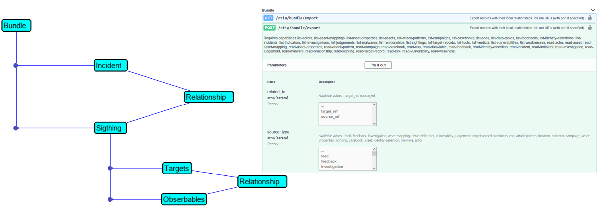
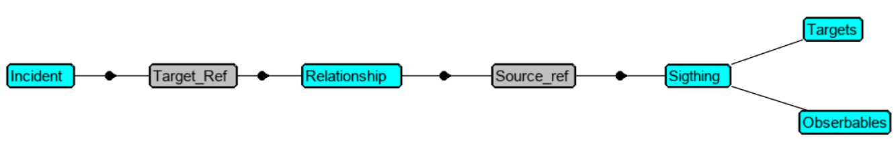

# Dealing with XDR CTIM ( Cisco Threat Intelligence Model )

XDR has a very power Threat Hunting Engine which execute automatically Threat Hunting operation that help Security Operators to understand Security Issues very quickly and Mitigate them.

But as this part has APIs for everything, within a SOC XDR can be used as online Threat Hunting services to be invoked every time we need an Threat Hunting service exposed by the plateform.

The **Incident Manager** is one of this XDR service which is very interesting to invoke on demand.

**Incidents** creation becomes one service which is mandatory to know.

## How can we create Incidents and Sightings within XDR ?
### Introduction 

Before going to the details about how we can create **incidents** and **sightings** within XDR, you must start first on understanding the CTIM model ( Cisco Threat Intell Model )

### Cisco Threat Intell Model

XDR / SecureX Threat Hunting and Incident Management rely on an internal data structure which is there as a very fast and efficient backend for supporting Threat Hunting activities.

This data structure has several services which all have APIs. That means that we can have access to these services from outside of XDR either for reading data, or for ingesting data we want to be computed by the XDR Threat Hunting Engine.

Managing **Incidents** within XDR is exactly that. Every components of the **Incident Manager** has an API and we use several of these APIs for creating **Incidents**.
- To learn more about **Cisco Threat Intell Model** you can to go to the following [ DEVNET Learning Lab ](https://developer.cisco.com/learning/tracks/cisco-xdr/cisco-xdr-advanced/private-intel-threat-feed/xdr-private-intelligence-overview/), which will help you to understand the details of how the CTIM APIs can be used into your Threat Hunting activities.
- And you will naturally want to intensively use CTIM API. Then the [ CTIM API documentation here ](https://github.com/threatgrid/ctim/blob/master/doc/tutorials/modeling-threat-intel-ctim.md) will be very usefull for you.

Once Having understanding the CTIM data structure, you are ready to move forward.

### Create Incidents and Sightings.

In order to create documented incidents into the XDR Incident Manager, we just have to create an **Incident** object first. And second we have to attach to it one or several **Sightings**. 

**Incidents** act as a object containers that gather every details of a specific discovered Security issue. This is the list of events ( so called Sightings ) that are attached to the same Security issue, with their timeline , with their observables and targets. The goal of the **Incident** documentation is to help Security Operators to go very fast, so for this everything in the Incident is sorted and presented in a maner that accelerate Threat Hunting.

**Sightings** are representation of the Security Alerts generated by Security Products that detects the threat in the network. **Sightings** are the Security Events. Within XDR, **sightings** are not the original alerts generated by the security products, but they are  translations of these original alerts into XDR Alert Schema. 

That means that **Sightings** in XDR are created from original the Security products raw alerts. **Sightings** are interpretations of these product events, which either sumarize themt or which extend them. We understand at this point that some process somewhere is needed to parse the original **events** and translate it into XDR **sightings*. The goal of this documentation is to explain that.

An **Incident** is supposed to contain several **Sightings** that can have been created from several separated Security Solutions **events**.

What we understand is that these Security Solutions are supposed to create **sightings** into XDR at the same time they detect a threat and generate a native alert for it. This is actually what happens with Security Products integrated within XDR. They all run a dedicated additionnal process which monitors product events directly within the product. And for some of these events, the process uses XDR **Sighting** APIs to create the sighting within XDR. This is the "event to sightings promotion process" which creates **Sightings** for the most impactful Security Events. 

We understand as well something else, which is the capability we have to create **XDR Incidents** from outside of the Security Product, but from the Security Alert Collector. So a good way to ingest Product Security Events into XDR is to create a process which periodically read Security Product events were they are collected ( like within a syslog server ) and then create XDR Incident on the behalf of the Security Product. This second approach is absolutely valid in terms of Security Strategy.

The goal of an **Incident** as object containers is to collect and gather all alerts that are related to the same security threat. Gathering these interpreted alerts in one place ( into an **incident** ) helps the Security Team to better understand what happen and help to react efficiently.

That means that one part of the complete **Incident** management process is to create an **Incident** if this one doesn't already exist and attach to it every **sightings** that are related to the same threat. And if the **Incident** already exists, then just attach to it **nex sightings** related to the same Security Issue.

**Sightings** are supposed to contain **targets** ( the victim machines ) and **observables** ( all suspicious objects which target victim machines ( **targets** ) ). And **Sightings** must contain the relationship that link targets and observables together.

Each relationship is a directed edge on a graph, and requires a source_ref, a target_ref, and a relationship-type.

When XDR receives any **observable**, then several Threat Hunting operations are automatically triggered. This is the case for enrichment and relation graph calculations.  And this is what help Security Operators to go very fast into Investigations. XDR automatically take a part of the investigation operations and present results to Security Operators.

This is where the XDR Threat Hunting power is.

**Relationship** is one of the key components of CTIM. It is used at several levels. This is a table that exists within the CTIM data structure. **Relationships** are used to attach a Sighting to an Incident. And **Relationship** are used to link an **observable** to a **target**. In these two case above we will talk about **Incident Relationships** and **Observable Relationships** event these object are located into the same XDR internal table.

At this point let's put all this above together : if we want to use XDR APIs to create an **Incident** within XDR, then we have to use the XDR APIs :

The most common to use will be ( They are enough to create XDR Incidents ) :

- Incident
- Relationships
- Sightings
- Judgments ( optionnal )

Other APIs are linked to **Incidents** but we don't use them in the context of this article. 

- Verdicts
- Indicators
- actors
- campaign
- coa ( course of actions, in other word the list of possible mitigation actions )

We understand that the CTIM internal data structure is already ready to manage more complex and more detailed security issue documentation. We don't cover these additional APIs in this article.

### Sightings

From original Security Product **events**, we are supposed to create one **Sighting per product event**. 

Every **Sightings** must contain **Observables** and their **targets**. And for every couple of observable to target, we have to find the **Relationship** that link the **observable** to the **target**. In this case we talk about **observable relationships**.

The list of the possible **observable relationships** values is big. You can have a look within the CTIM schema what are the possible values.

[CTIM observable relation map documentation](https://github.com/threatgrid/ctim/blob/74857ac6ffed206b3dcf01f171feb30e08277191/src/ctim/schemas/common.cljc#L408)

And then you can understand easily the meaning of these values and when to use them.

Thanks to this schema we understand how wide the scope is for describing complex relationships between objects. We understand that we can described almost object meshed that can exist within the IT.

The XDR attack graph is builted upon these relationships. This graph is a just a visual representation of these relationships and XDR is just en renderer tools that graph what is stored into the CTIM datastructure.

You probably understand at this point that if you know how to ingest into XDR CTIM objects and their relationship, then you can visualize any kind of interesting graph. This is correct !

Okay let's move forward on the **sighings** creation process.

### Incidents

Once **Sightings** are created, then we can create an **Incident** and attach every **Sigthings** to it thank to another kind of relationships. With actually and Incident relationship. Attaching **Sightings** to **Incidents** is basically done with the **member of** relationship. We don't need to use other relationship values

But in order to have the knowledge of it, here is the CTIM Incident relationships possible values :

- attributed-to
- based-on
- duplicate-of
- derived-from
- detects
- element-of
- exploits
- indicates
- member-of
- mitigates
- related-to
- targets
- uses
- variant-of

The value to use depends on the context which links objects together. This context is mainly lead by the object nature.

Have a look to the following documentation in order to have guidelines on this : [Defined Entity Relationships](https://github.com/threatgrid/ctim/blob/master/doc/defined_relationships.md)

### Observables types.

Before moving forward, let's talk about **targets** and **observables**. We will see later in the documentation that they way to declare these objects are not the same. But for both objects we have to determine an object type which is a mandatory attribute to use mention.

The list here under gives you the possible object type values :

- ip
- ipv6
- device ;; Was mac
- user
- domain
- sha256
- md5
- sha1
- url
- pki_serial
- email
- imei
- imsi
- amp_computer_guid
- hostname
- mac_address
- file_name
- file_path
- odns_identity
- odns_identity_label
- email_messageid
- email_subject
- cisco_mid
- mutex

You can refer to the following CTIM schema : [Observable Types](https://github.com/threatgrid/ctim/blob/74857ac6ffed206b3dcf01f171feb30e08277191/src/ctim/schemas/vocabularies.cljc#L240)

We understand that for every observables we will have to determine it's type. The best to acheive this is to use the XDR **inspect** API which is dedicated for this.

## Create Incidents and their sightings

Creating an **Incident** consists of creating several objects and then link them together thanks to relationships.

That means that we are supposed to use several APIs calls to create all what is needed to create an Incident and all the attached objects. 

This can be a lot of API calls !

CTIM developpers thought about making life easy for programmers. They created the **bundle** API.

This API allows programmers to create an **Incident** with everything inside thanks to only one single API call.

The **bundle API** expects a JSON payload to be sent to the API. This JSON payload must contain all the objects we need to create the fully documented **Incident**.

**How can we invoke the bundle API ?**

For creating a **bundle** We have to create a "bundle" JSON payload which contains one **incident** declaration. 

Then we have to add  into it  one or several **Sightings**.

Then we add into the JSON payload, **relationships** that link every **sightings** to the **Incident** thanks to a **"member of"** **relationship**.

Into every single **sighting**, we have to include every **targets** and **observables** extracted from the raw Security Solution Alert. And we have to create as well **relationships** between all these objects within the **sightings** itself. These 3 things, **targets**, **observables** and **relationships** are 3 separate keys into the **Sighting** JSON data.

The way to link object together is to use their ID. Actually external IDs which are unique identifiers within the XDR CTIM datastructure which must already exists before building the bundle JSON payload. That actually means that one of the first operation to do when we have identified all the objects that will compose the **Incident**, is to create every need **external IDs : xid**.

Then the bundle creation is just an assembly of every object definition ( dictionnary keys ) into a JSON payload.

And that's it.

Have a look to the [**SecureX Threat Response CTIM Bundle Builder** page ](https://github.com/CiscoSecurity/tr-05-ctim-bundle-builder) to learn about a python module that simplifies **bundle** creation.

### How to read an Incident and parse all Sightings it contains ?

We understood above the steps to create an XDR **Incident** and attached **Sightings**. One common operation we will have to do is to read and parse an existing **Incident**. 

It makes really sense !. In some extents XDR **Incident** and **Sighting** datastorage act as a Security Log Server which can be intersting to query. So it is worthit to learn about how to parse these objects, we will creatainly have to do it frequently

When we create the **Incident** and all **Sightings** it contains, we assign IDs to all objects, and these IDs will be used within the **relationships**. These IDs are known as **target_ref** for incident ID and **source_ref** for Sighting IDs.

For reading **sigthings** that belong to an **Incident** we must first retrieve its **target_ref** and search for **relationships** based on this **target_ref** information. Thanks to this, we get the list of all **sightings** that belong to the **Incident** and we can get their **source_ref** IDs. Then, for each **Sighting**, based on its **source_ref** we parse it and extract from it everything which is relevant for additionnal investigation. This is mainly **Targets** and **Observables**

## XDR and SecureX don't create incidents the same way !

Incident managements principles are exactly the same for XDR and SecureX.  But XDR doesn't use the same APIs for creating **Incidents**.

That means that everything described into this article is valid for both platform.  But **Incidents** APIs are differents.

One main reason of that is that XDR take into account **asset priority** and not SecureX. A consequence of this is that the code for creating the Incident is not the same.

This is why we have 2 separated version of the lab simulator. **lab_simulator-001** is dedicated to SecureX demos, and **lab_simulator-002** is dedicated to XDR demos.

## Additional resources

Don't hesitate to have a look to this awesome DEVNET learning lab that digs into Incident creation and bundle details.

[Create an Incident with Workflow for Cisco XDR](https://developer.cisco.com/learning/tracks/cisco-xdr/cisco-xdr-advanced/create-incident-with-workflow/introduction/)